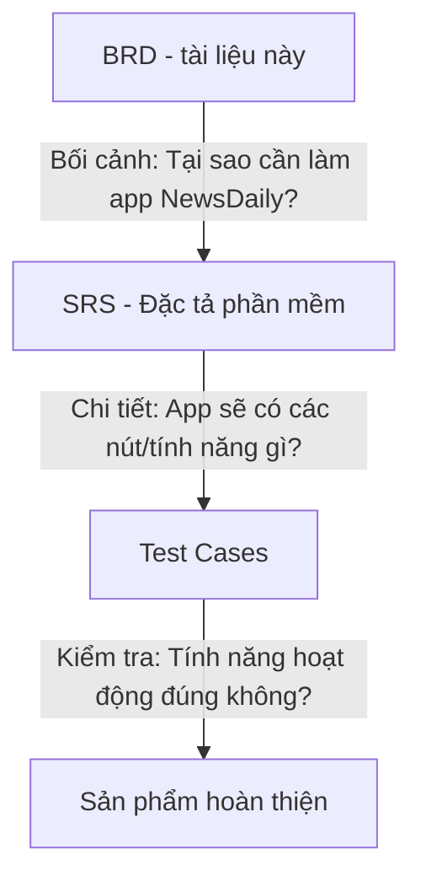
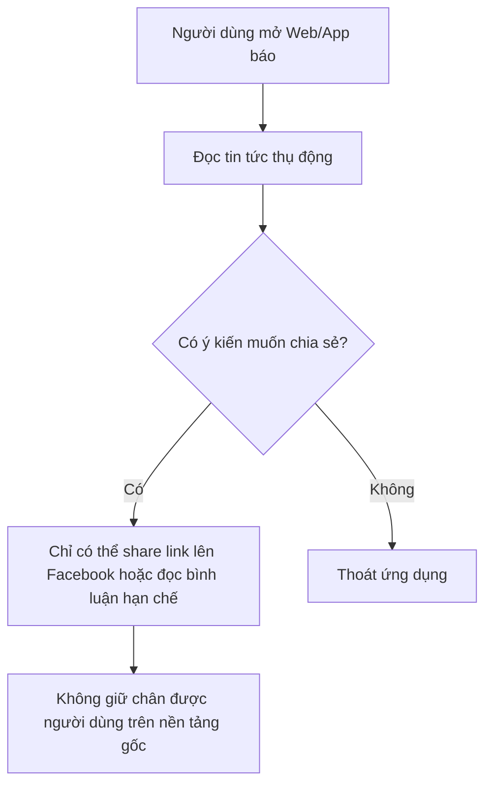
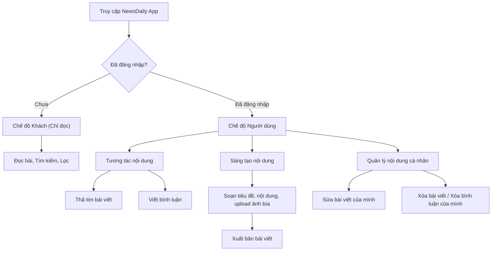

# BRD — Tài liệu Yêu cầu Nghiệp vụ
## (Business Requirements Document)

> **📚 Hệ thống hư cấu / Fictional System**: Dự án "NewsDaily" là hệ thống ứng dụng đọc tin tức và mạng xã hội thu nhỏ được thiết kế cho mục đích tham khảo. Các dữ liệu và tổ chức trong tài liệu là giả lập.

> **📌 Lưu ý**: Đây là tài liệu Yêu cầu Nghiệp vụ (BRD) mô tả lý do tại sao dự án được thực hiện và các mục tiêu kinh doanh. Tài liệu SRS đã được tạo trước đó sẽ là tài liệu kỹ thuật chi tiết đi kèm.

| Thông tin tài liệu | |
|---|---|
| **Dự án** | Ứng dụng đọc tin tức và tương tác nội dung — NewsDaily |
| **Phiên bản** | 1.0 |
| **Ngày tạo** | 23/04/2026 |
| **Người yêu cầu** | Ban Giám đốc (Sponsor) |
| **Người phân tích/PO** | Phan Thế Kỳ — Product Owner (PO) / Business Analyst (BA) |

---

## 1. Bối cảnh

Hiện nay, người dùng có xu hướng không chỉ muốn đọc tin tức thụ động mà còn muốn bày tỏ quan điểm, thảo luận và tự tạo ra các bài viết chia sẻ kiến thức của riêng mình (User-Generated Content). 
Tuy nhiên, các nền tảng báo chí truyền thống thường thiếu tính năng tương tác cộng đồng mạnh mẽ, trong khi các mạng xã hội lớn lại quá loãng thông tin và khó tập trung vào các chủ đề chuyên sâu (như Công nghệ, SEO, Marketing).

Ban Giám đốc mong muốn xây dựng "NewsDaily" — một ứng dụng di động vừa đóng vai trò cung cấp tin tức, vừa là sân chơi để cộng đồng người dùng tự do sáng tạo nội dung, bình luận và chia sẻ kiến thức.

---

## 2. Mục tiêu nghiệp vụ

| Mã | Mục tiêu | Độ ưu tiên |
|----|---------|-----------|
| BO-01 | Xây dựng nền tảng cho phép người dùng đọc, tìm kiếm và lọc tin tức theo chủ đề | Cao |
| BO-02 | Tạo cơ chế tương tác: Thả cảm xúc (Heart) và Bình luận trên từng bài viết | Cao |
| BO-03 | Cung cấp công cụ để người dùng tự tạo, chỉnh sửa và quản lý bài viết của chính họ | Cao |
| BO-04 | Thu thập dữ liệu người dùng qua việc đăng ký/đăng nhập để cá nhân hóa nội dung sau này | Trung bình |
| BO-05 | Đảm bảo tính an toàn nội dung thông qua cơ chế quản lý của Admin (xóa bài/bình luận vi phạm) | Cao |

---

## 3. Phạm vi dự án

### 3.1. Trong phạm vi (In-scope)
- Quản lý tài khoản: Đăng ký, đăng nhập bằng email.
- Phân quyền: Khách (chỉ xem), Người dùng (tương tác, đăng bài), Admin (quản lý nội dung).
- Nguồn cấp tin tức (News Feed): Danh sách bài đăng, phân trang, làm mới dữ liệu.
- Tính năng tương tác: Thả tim (Like), Bình luận (Comment).
- Quản lý nội dung cá nhân: Đăng bài viết mới (có ảnh bìa, tiêu đề, nội dung, thể loại), sửa bài, xóa bài.
- Tìm kiếm cơ bản và Lọc theo thể loại.

### 3.2 Ngoài phạm vi (Out-of-scope)
- Tính năng Chat trực tiếp (Direct Message) giữa các người dùng.
- Kiếm tiền từ bài viết (Monetization / Trả tiền bản quyền).
- Đăng nhập bằng mạng xã hội (Google, Facebook, Apple).
- Upload và phát Video (chỉ hỗ trợ hình ảnh và text).
- Ứng dụng nền web (Giai đoạn này chỉ tập trung vào Mobile App).

---

## 4. Quy trình nghiệp vụ hiện tại (As-Is - Báo chí truyền thống)

**Vấn đề chính:**
- Thiếu tính gắn kết cộng đồng.
- Người dùng có kiến thức chuyên môn không có công cụ đóng góp bài viết trực tiếp lên nền tảng nếu không phải là nhà báo.

---

## 5. Quy trình nghiệp vụ mong muốn (To-Be - App NewsDaily)

---

## 6. Quy tắc nghiệp vụ

| Mã | Quy tắc | Chi tiết |
|----|---------|---------|
| BR-01 | Phân quyền tương tác | Khách (Guest) tuyệt đối không được Thả tim, Bình luận hay Đăng bài. Phải bật popup yêu cầu Đăng nhập. |
| BR-02 | Quyền sở hữu nội dung | User A chỉ được Sửa/Xóa bài viết và bình luận do chính User A tạo ra. Không tác động được lên dữ liệu của User B. |
| BR-03 | Quyền tối cao của Admin | Admin có quyền xóa bất kỳ bài viết hoặc bình luận nào nếu vi phạm tiêu chuẩn cộng đồng mà không cần hỏi ý kiến tác giả. |
| BR-04 | Đếm tương tác | Một tài khoản chỉ được tính 1 lượt thả tim trên mỗi bài viết (Toggle Like/Unlike). |
| BR-05 | Ràng buộc đăng bài | Bài viết bắt buộc phải có Tiêu đề (10-150 ký tự), Nội dung (tối thiểu 50 ký tự) và phải chọn ít nhất 1 thể loại. |

---

## 7. Các bên liên quan (Stakeholders)

| Vai trò | Người đại diện | Mối quan tâm chính |
|---------|---------------|-------------------|
| Ban Giám đốc (Sponsor) | Trần Văn Sếp | Dự án ra mắt đúng hạn, thu hút được người dùng sáng tạo nội dung. |
| Product Owner / BA | Phan Thế Kỳ | Yêu cầu rõ ràng, hệ thống giải quyết đúng bài toán nghiệp vụ, luồng UX/UI hợp lý. |
| Đội ngũ Dev & QC | Công ty TNHH Phần mềm XYZ | Tài liệu chi tiết để lập trình bằng Flutter và test API. |
| Bộ phận Content/SEO | Nguyễn Thị Content | Có đủ thể loại bài viết phù hợp để phân phối và làm Marketing. |

---

## 8. Ràng buộc và giả định

### Ràng buộc:
- **Công nghệ:** Ứng dụng phải được phát triển đa nền tảng (iOS & Android) bằng framework Flutter để tối ưu nguồn lực.
- **Backend:** Dùng hệ thống RESTful API hoặc Firebase để lưu trữ, đảm bảo real-time tương tác.
- **Kinh phí:** Hạn chế, do đó không tích hợp các dịch vụ tốn phí cao (như video streaming) trong Phase 1.

### Giả định:
- Người dùng mục tiêu có độ tuổi từ 16 - 35, quen thuộc với các thao tác ứng dụng mạng xã hội cơ bản.
- Lượng người dùng đồng thời (CCU) trong tháng đầu tiên không vượt quá 5,000 users.

---

## 9. Tiêu chí nghiệm thu mức độ nghiệp vụ (Acceptance Criteria)

| Mã | Tiêu chí | Phương pháp kiểm tra |
|----|---------|---------------------|
| AC-01 | Đăng nhập/Đăng ký hoạt động ổn định | Người dùng tạo được tài khoản mới và truy cập thành công |
| AC-02 | Guest không thể tương tác | Guest nhấn nút Like/Comment -> Hiện yêu cầu đăng nhập |
| AC-03 | Luồng xuất bản bài viết | Điền đủ thông tin bài viết -> Nhấn Đăng -> Bài viết xuất hiện trên Feed |
| AC-04 | Quản lý độc quyền nội dung | Đăng nhập User A -> Vào bài của User B -> Không thấy nút Sửa/Xóa |
| AC-05 | Admin kiểm duyệt | Đăng nhập quyền Admin -> Xóa thành công bài viết của một User bất kỳ |

---

## 10. Lịch trình dự kiến (Timeline)

| Giai đoạn | Thời gian | Sản phẩm đầu ra |
|-----------|----------|---------|
| Chốt Yêu cầu & Thiết kế UI/UX | Tuần 1-2 | Tài liệu BRD, SRS, Thiết kế Figma |
| Lập trình Backend (API) & Database | Tuần 3-4 | Hệ thống cơ sở dữ liệu và API hoàn thiện |
| Lập trình Frontend (Flutter App) | Tuần 4-6 | Bản build App (APK/TestFlight) |
| Kiểm thử hệ thống (UAT) | Tuần 7 | Báo cáo lỗi, fix bug |
| Ra mắt chính thức (Go-live) | Cuối Tuần 8 | App xuất hiện trên App Store & Google Play |